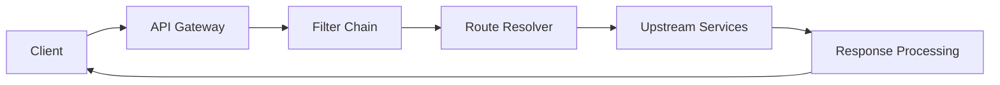

# API Gateway (From Scratch)

A custom API Gateway implementation that demonstrates request routing, middleware orchestration, and centralized policy enforcement in a stateless architecture.

---

## Problem It Solves

In microservice systems, cross-cutting concerns such as authentication, validation, logging, and rate limiting are often duplicated across services. This gateway centralizes those concerns to reduce service complexity and enforce consistent request policy.

## Key Features

- Dynamic request routing based on path and method
- Filter chain for authentication, logging, and validation
- Integration with distributed rate limiter
- Centralized request lifecycle handling
- Stateless processing for horizontal scaling
- Pluggable middleware architecture

## Architecture

## How it works (high level)

- Requests enter through the gateway entrypoint.
- Pre-routing filters handle authentication, validation, logging, and rate limiting.
- The route resolver selects the target upstream service.
- Gateway forwards the request and processes the service response.
- Response path applies standardized mapping and returns to the client.

## How It Works (Detailed)

### Request Lifecycle

- Incoming request enters the gateway context
- Filters run in deterministic order
- Route is resolved from configured rules
- Upstream request is forwarded and response is returned

### Middleware Chain

- Each middleware is a focused responsibility unit
- Chain-of-responsibility pattern keeps behavior composable
- New filters can be inserted without touching core routing logic

### Integrated Rate Limiting

- Gateway delegates allowance decision to distributed rate limiter
- Rejections are returned early to protect upstream services
- Limits can be scoped by API key, user, route, or global policy

## Performance / Benchmarks

Typical baseline observations in a local setup:

- Median added latency depends primarily on filter count and external calls
- Stateless gateway instances scale linearly behind load balancers
- Early rejection (auth/rate limit) reduces upstream saturation under attack

For reliable comparisons, benchmark with fixed route mix, payload profiles, and middleware configuration.

## Example Use Cases

- Single entrypoint for microservice ecosystems
- Policy enforcement for public APIs
- Traffic governance with centralized throttling
- Request tracing and audit logging

## Trade-offs and Design Decisions

- Custom gateway provides flexibility but requires ongoing platform ownership
- Middleware extensibility improves agility while increasing composition complexity
- Stateless design simplifies scaling but requires external systems for shared state

## Next Improvements

- Add service discovery and health-aware routing
- Add circuit breaker and retry policies per route
- Add configuration hot-reload for dynamic route updates
- Add structured observability for filter-level latency breakdown

## Benchmark Methodology

For consistent gateway profiling, use:

- Fixed route distribution and payload classes
- Identical middleware chain per compared run
- Separate no-upstream and upstream-included latency numbers
- p50/p95/p99 latency with request error-rate reporting
